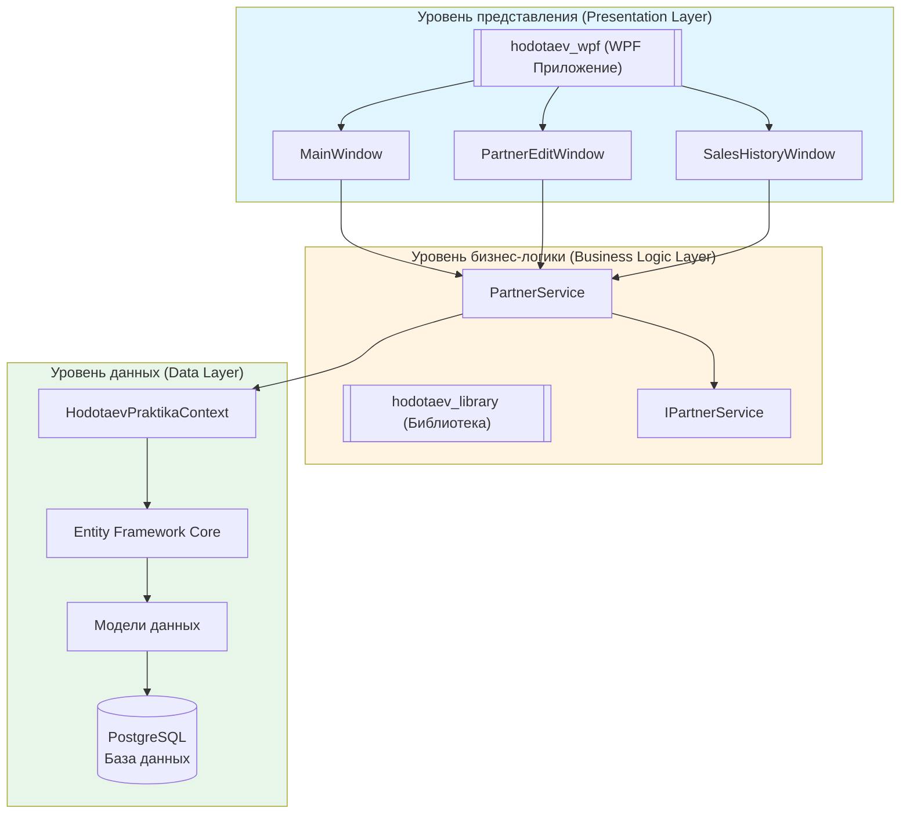
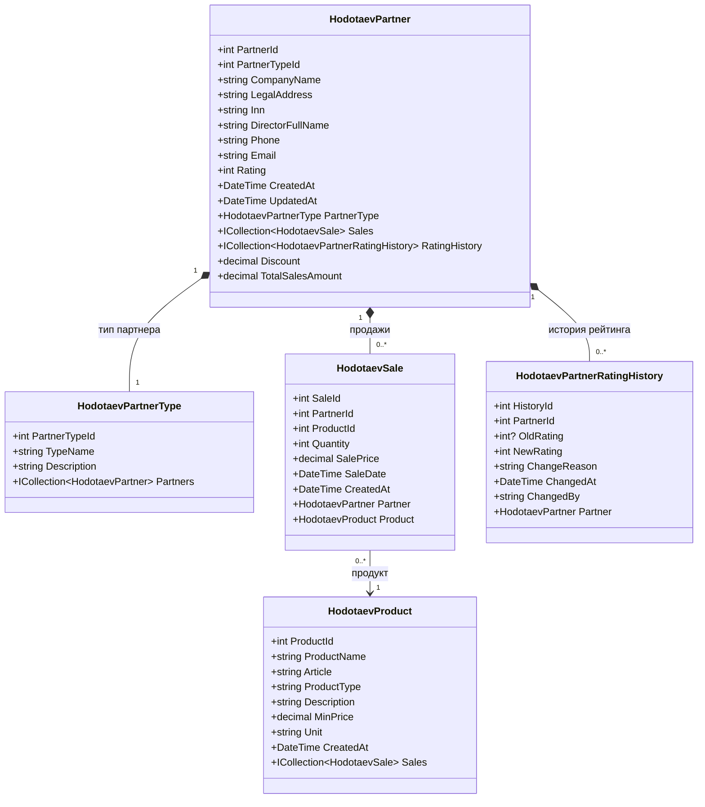
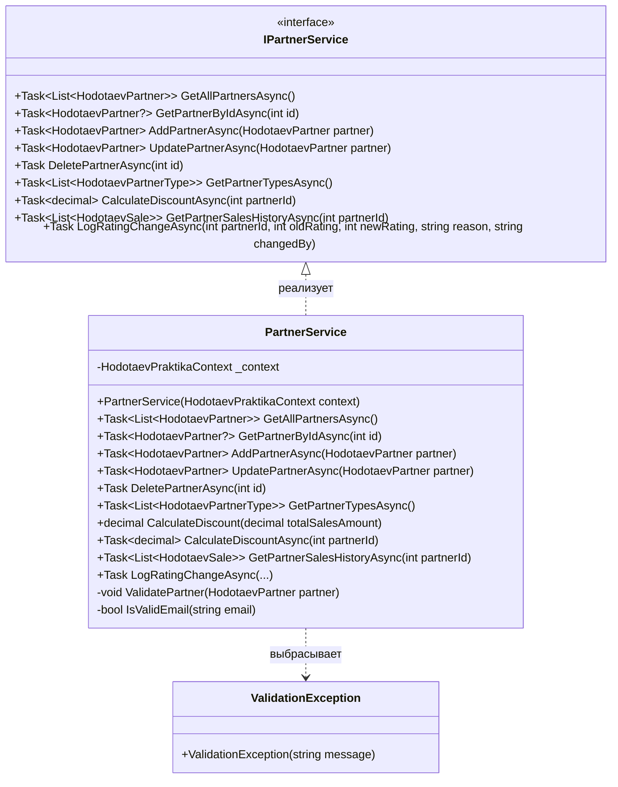
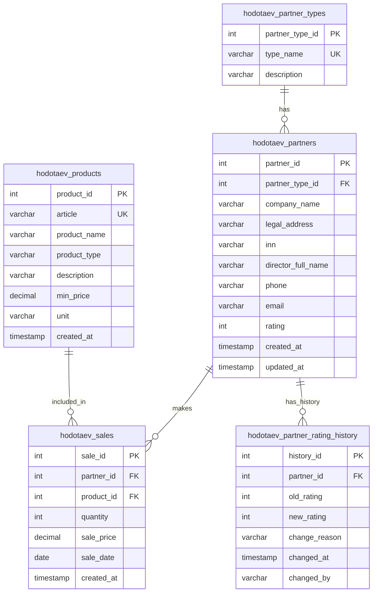
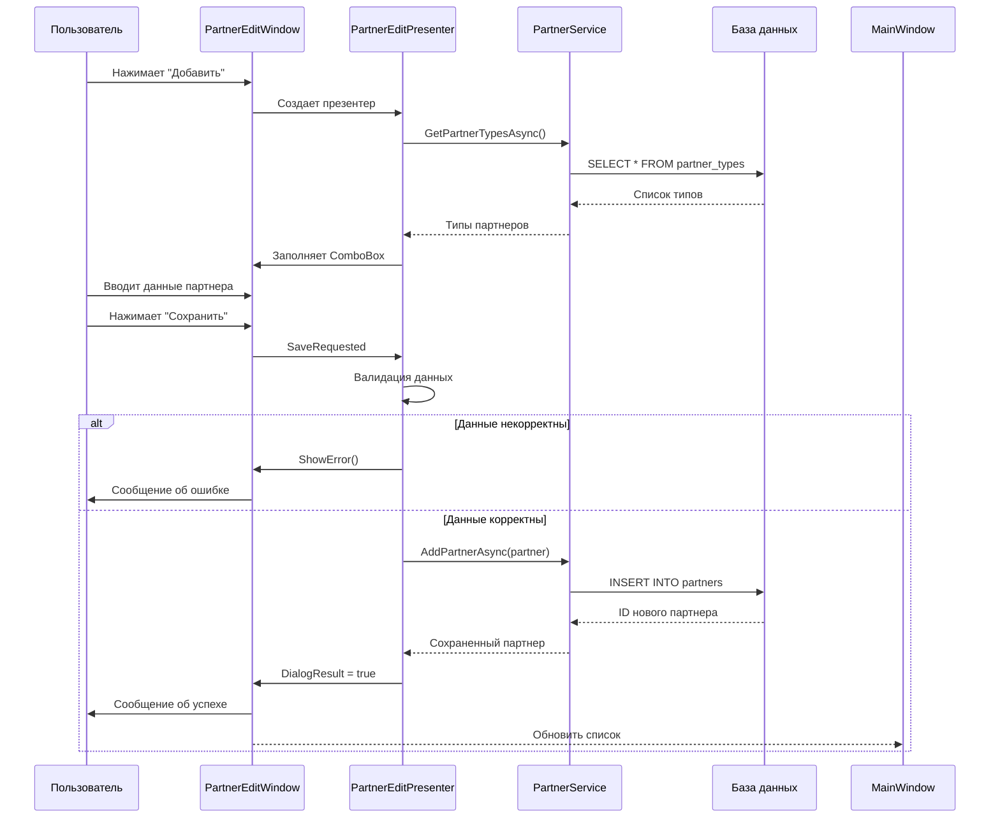
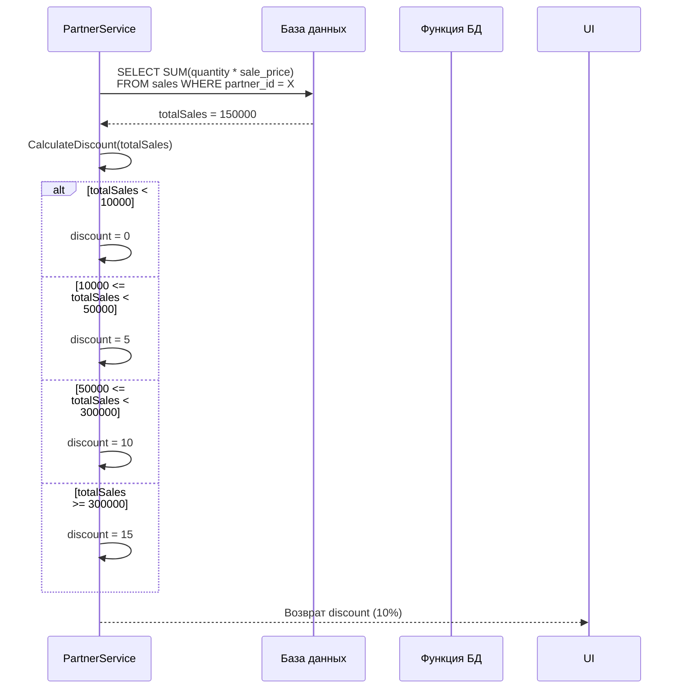
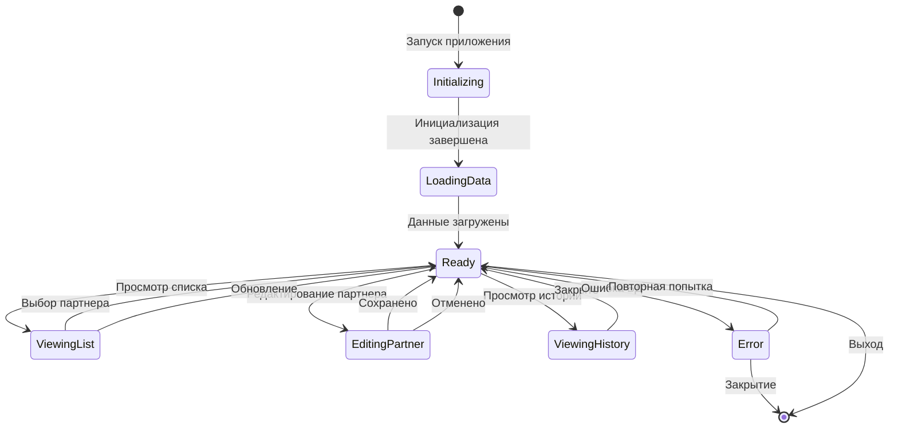

# Диаграммы Mermaid для сопроводительной записки hodotaev_praktika

---

## ДИАГРАММА 1: Архитектура системы



---

## ДИАГРАММА 2: Диаграмма классов моделей данных



---

## ДИАГРАММА 3: Диаграмма классов сервисов



---

## ДИАГРАММА 4: ER-диаграмма базы данных



---

## ДИАГРАММА 5: Паттерн MVP

```mermaid
flowchart LR
    subgraph View["View (Представление)"]
        IView[IMainView<br/>IPartnerEditView<br/>ISalesHistoryView]
        WPF[MainWindow<br/>PartnerEditWindow<br/>SalesHistoryWindow]
    end
    
    subgraph Presenter["Presenter (Презентер)"]
        MP[MainPresenter]
        PEP[PartnerEditPresenter]
        SHP[SalesHistoryPresenter]
    end
    
    subgraph Model["Model (Модель)"]
        PS[PartnerService]
        MOD[Модели данных]
    end
    
    WPF --> IView : реализует
    IView --> MP : события
    IView --> PEP : события
    IView --> SHP : события
    
    MP --> PS : вызов методов
    PEP --> PS : вызов методов
    SHP --> PS : вызов методов
    
    MP --> WPF : обновление UI
    PEP --> WPF : обновление UI
    SHP --> WPF : обновление UI
    
    PS --> MOD : работа с данными
    
    style View fill:#e1f5ff
    style Presenter fill:#fff4e1
    style Model fill:#e8f5e9
```

---

## ДИАГРАММА 6: Схема главного окна

```mermaid
flowchart TB
    subgraph MainWindow["MainWindow - Главное окно"]
        Title[Заголовок: "Управление партнерами"]
        
        subgraph Toolbar["Панель инструментов"]
            BtnAdd[Кнопка "Добавить"]
            BtnEdit[Кнопка "Редактировать"]
            BtnDelete[Кнопка "Удалить"]
            BtnHistory[Кнопка "История продаж"]
            BtnRefresh[Кнопка "Обновить"]
            BtnExit[Кнопка "Выход"]
        end
        
        subgraph Content["Основная область"]
            subgraph LeftPanel["Левая панель"]
                ListBox[ListBox: Список партнеров]
            end
            
            subgraph RightPanel["Правая панель"]
                CardTitle[Заголовок: "Информация о партнере"]
                Company[Компания]
                PartnerType[Тип партнера]
                Director[Директор]
                Phone[Телефон]
                Email[Email]
                Rating[Рейтинг]
                Address[Адрес]
                Inn[ИНН]
                Stats[Блок статистики<br/>Объем продаж<br/>Скидка]
            end
        end
        
        subgraph StatusBar["Строка состояния"]
            Status[Статус]
            Count[Количество партнеров]
        end
    end
    
    Title --> Toolbar
    Toolbar --> Content
    Content --> StatusBar
    
    LeftPanel --> RightPanel : выделение партнера
```

---

## ДИАГРАММА 7: Последовательность добавления партнера



---

## ДИАГРАММА 8: Последовательность расчета скидки



---

## ДИАГРАММА 9: Активность удаления партнера

```mermaid
flowchart TD
    Start([Начало]) --> Select{Партнер<br/>выбран?}
    
    Select -->|Нет| Warn1[Показать предупреждение]
    Warn1 --> End([Конец])
    
    Select -->|Да| Confirm{Подтверждение<br/>удаления?}
    
    Confirm -->|Нет| End
    
    Confirm -->|Да| Check{Есть<br/>продажи?}
    
    Check -->|Да| Error1[Показать ошибку<br/>"Существуют записи о продажах"]
    Error1 --> End
    
    Check -->|Нет| Delete[DELETE FROM partners<br/>WHERE partner_id = X]
    
    Delete --> Success[Показать сообщение<br/>"Партнер успешно удален"]
    
    Success --> Refresh[Обновить список]
    
    Refresh --> End
```

---

## ДИАГРАММА 10: Состояния приложения



---

## ДИАГРАММА 11: Компонентная диаграмма

```mermaid
flowchart TB
    subgraph App["hodotaev_praktika"]
        subgraph WPF["hodotaev_wpf"]
            MW[MainWindow]
            PEW[PartnerEditWindow]
            SHW[SalesHistoryWindow]
            App[App.xaml.cs]
        end
        
        subgraph Lib["hodotaev_library"]
            subgraph Models["Models"]
                Partner[HodotaevPartner]
                PartnerType[HodotaevPartnerType]
                Product[HodotaevProduct]
                Sale[HodotaevSale]
                RatingHist[HodotaevPartnerRatingHistory]
            end
            
            subgraph Data["Data"]
                Context[HodotaevPraktikaContext]
            end
            
            subgraph Services["Services"]
                IPS[IPartnerService]
                PS[PartnerService]
            end
        end
        
        subgraph Tests["hodotaev_library.Tests"]
            DiscountTests[DiscountCalculationTests]
            ValidationTests[PartnerValidationTests]
        end
    end
    
    MW --> PS
    PEW --> PS
    SHW --> PS
    
    PS --> Context
    PS --> IPS
    
    Context --> Partner
    Context --> PartnerType
    Context --> Product
    Context --> Sale
    Context --> RatingHist
    
    DiscountTests --> PS
    ValidationTests --> PS
```

---

## ДИАГРАММА 12: Диаграмма развертывания

```mermaid
flowchart TB
    subgraph Client["Клиентский компьютер"]
        App[["hodotaev_wpf.exe<br/>(.NET 8.0 App)"]]
        Runtime[".NET 8.0 Runtime"]
    end
    
    subgraph Server["Сервер БД"]
        PG[["PostgreSQL 17<br/>(hodotaev_praktika)"]]
        Schema[Схема: app]
        Tables[Таблицы:<br/>- hodotaev_partner_types<br/>- hodotaev_partners<br/>- hodotaev_products<br/>- hodotaev_sales<br/>- hodotaev_partner_rating_history]
    end
    
    App --> Runtime : использует
    App -->|Npgsql 8.0<br/>TCP/IP:5432| PG
    PG --> Schema : содержит
    Schema --> Tables : содержит
    
    style Client fill:#e1f5ff
    style Server fill:#e8f5e9
```

---
