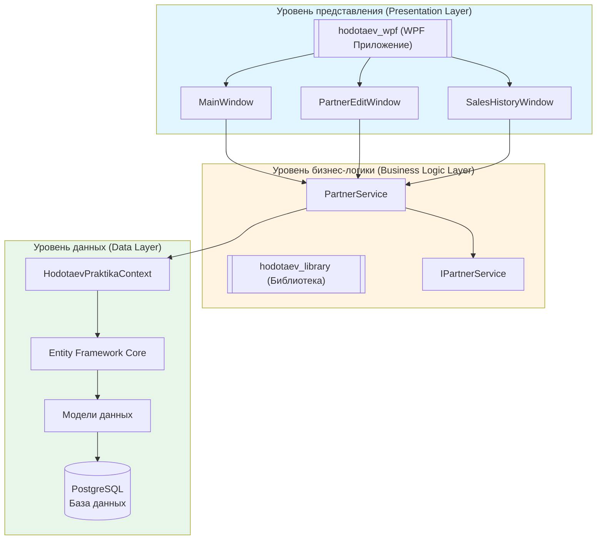
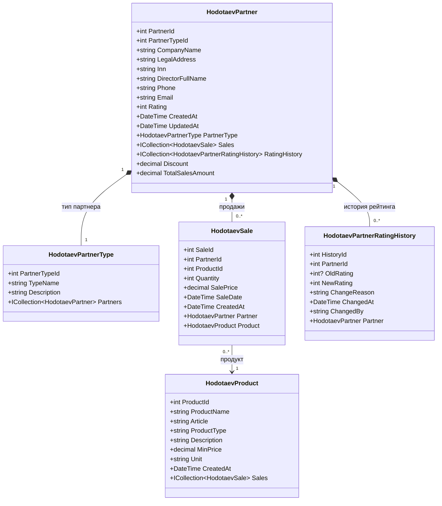
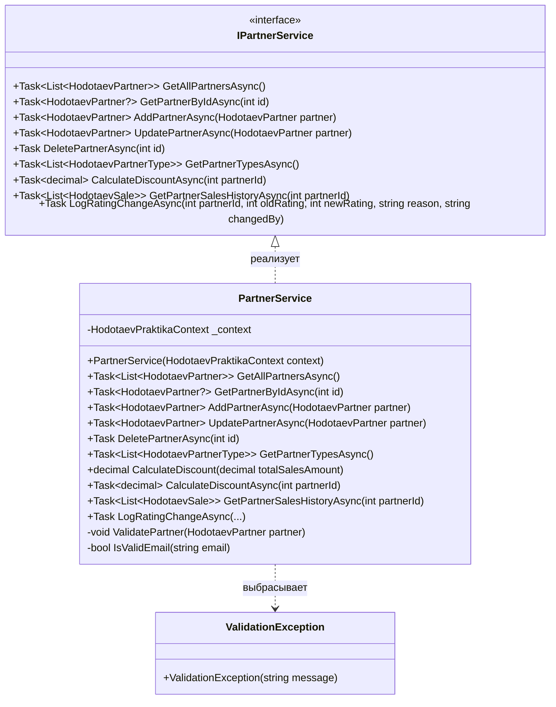
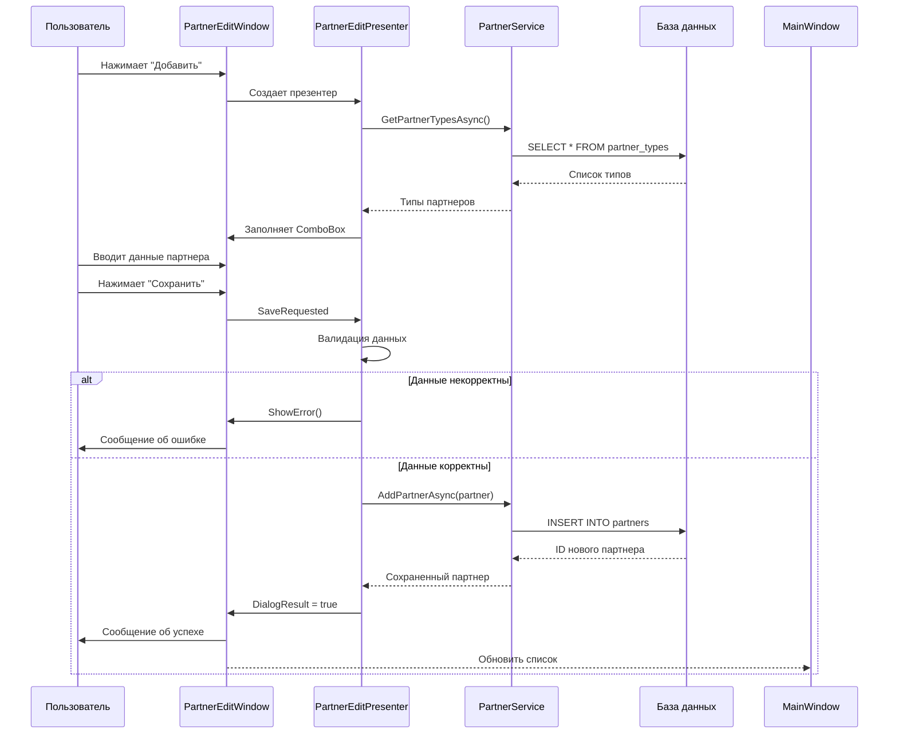
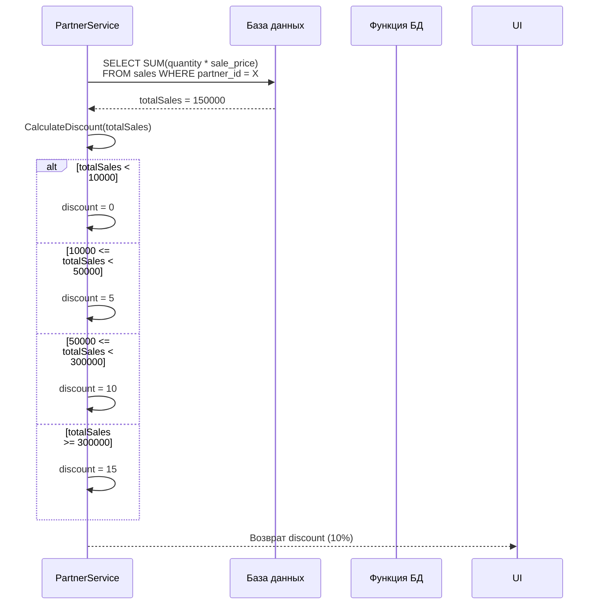
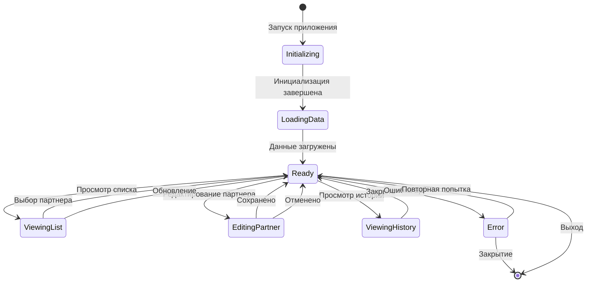

# ПОДРОБНОЕ ОПИСАНИЕ ПРОГРАММЫ
## hodotaev_praktika — Подсистема работы с партнерами компании

---

# 1. ОБЩИЕ СВЕДЕНИЯ

## 1.1. Назначение программы

**hodotaev_praktika** — это десктопное приложение на платформе WPF (.NET 8.0), предназначенное для автоматизации управления партнерской сетью производственной компании «Мастер Пол». Приложение предоставляет возможности ведения реестра партнеров, расчета индивидуальных скидок на основе истории продаж, просмотра детальной информации о реализации продукции.

## 1.2. Область применения

- Автоматизация работы менеджеров по работе с партнерами;
- Ведение единого реестра партнеров с классификацией по типам;
- Расчет и контроль индивидуальных скидок;
- Анализ истории продаж партнеров;
- Мониторинг рейтинга партнеров.

## 1.3. Технологический стек

| Компонент | Технология |
|-----------|------------|
| Платформа | .NET 8.0 |
| UI-фреймворк | WPF (Windows Presentation Foundation) |
| ORM | Entity Framework Core 8.0 |
| СУБД | PostgreSQL 14+ |
| Драйвер БД | Npgsql 8.0 |
| Архитектурный паттерн | MVP (Model-View-Presenter) |
| DI-контейнер | Microsoft.Extensions.DependencyInjection |

---

# 2. АРХИТЕКТУРА СИСТЕМЫ

## 2.1. Трехуровневая архитектура

Приложение построено по принципу разделения ответственности между тремя уровнями:

**(тут диаграмма 1 — Архитектура системы)**



### Уровень 1: Уровень представления (Presentation Layer)

**Проект:** `hodotaev_wpf`

**Назначение:** Взаимодействие с пользователем, отображение данных, обработка пользовательского ввода.

**Компоненты:**
- **MainWindow** — главное окно со списком партнеров и карточкой выбранного партнера;
- **PartnerEditWindow** — окно для добавления и редактирования данных партнера;
- **SalesHistoryWindow** — окно для просмотра истории продаж партнера;
- **Presenters** — презентеры для управления логикой представления (MVP);
- **Views** — интерфейсы для окон (IMainView, IPartnerEditView, ISalesHistoryView).

### Уровень 2: Уровень бизнес-логики (Business Logic Layer)

**Проект:** `hodotaev_library`

**Назначение:** Реализация бизнес-правил, валидация данных, расчет скидок, работа с данными.

**Компоненты:**
- **PartnerService** — основной сервис для CRUD-операций с партнерами;
- **IPartnerService** — интерфейс сервиса для внедрения зависимостей;
- **Models** — модели данных (сущности);
- **Data** — контекст базы данных Entity Framework Core.

### Уровень 3: Уровень данных (Data Layer)

**СУБД:** PostgreSQL 14+

**Назначение:** Хранение и извлечение данных, обеспечение ссылочной целостности.

**Компоненты:**
- **HodotaevPraktikaContext** — контекст базы данных;
- **Таблицы:** hodotaev_partners, hodotaev_partner_types, hodotaev_products, hodotaev_sales, hodotaev_partner_rating_history.

---

# 3. МОДЕЛИ ДАННЫХ

## 3.1. Описание моделей

**(тут диаграмма 2 — Диаграмма классов моделей данных)**



## 3.2. Подробное описание свойств моделей

### HodotaevPartner (Партнер компании)

| Свойство | Тип | Описание | Ограничения |
|----------|-----|----------|-------------|
| PartnerId | int | Уникальный идентификатор партнера | Первичный ключ, автоинкремент |
| PartnerTypeId | int | Ссылка на тип партнера | Внешний ключ, обязательно |
| CompanyName | string | Наименование компании | NOT NULL, max 255 символов |
| LegalAddress | string | Юридический адрес | max 500 символов |
| Inn | string | ИНН организации | max 20 символов |
| DirectorFullName | string | ФИО директора | max 255 символов |
| Phone | string | Контактный телефон | max 50 символов |
| Email | string | Электронная почта | max 100 символов, формат email |
| Rating | int | Рейтинг партнера | ≥ 0 |
| CreatedAt | DateTime | Дата создания записи | По умолчанию UtcNow |
| UpdatedAt | DateTime | Дата изменения записи | По умолчанию UtcNow |
| Discount | decimal | Вычисляемая скидка | [NotMapped] |
| TotalSalesAmount | decimal | Общий объем продаж | [NotMapped] |

### HodotaevPartnerType (Тип партнера)

| Свойство | Тип | Описание | Ограничения |
|----------|-----|----------|-------------|
| PartnerTypeId | int | Уникальный идентификатор типа | Первичный ключ |
| TypeName | string | Наименование типа | UNIQUE, max 100 символов |
| Description | string | Описание типа | max 500 символов |

### HodotaevProduct (Продукция)

| Свойство | Тип | Описание | Ограничения |
|----------|-----|----------|-------------|
| ProductId | int | Уникальный идентификатор продукта | Первичный ключ |
| ProductName | string | Наименование продукта | NOT NULL, max 255 символов |
| Article | string | Артикул продукта | UNIQUE, max 50 символов |
| ProductType | string | Тип продукта | max 100 символов |
| Description | string | Описание продукта | max 1000 символов |
| MinPrice | decimal | Минимальная цена | ≥ 0, decimal(10,2) |
| Unit | string | Единица измерения | max 50 символов |
| CreatedAt | DateTime | Дата создания записи | По умолчанию UtcNow |

### HodotaevSale (Продажа)

| Свойство | Тип | Описание | Ограничения |
|----------|-----|----------|-------------|
| SaleId | int | Уникальный идентификатор продажи | Первичный ключ |
| PartnerId | int | Ссылка на партнера | Внешний ключ, обязательно |
| ProductId | int | Ссылка на продукт | Внешний ключ, обязательно |
| Quantity | int | Количество проданных единиц | > 0 |
| SalePrice | decimal | Цена за единицу | ≥ 0, decimal(10,2) |
| SaleDate | DateTime | Дата продажи | По умолчанию UtcNow |
| CreatedAt | DateTime | Дата создания записи | По умолчанию UtcNow |

### HodotaevPartnerRatingHistory (История рейтинга)

| Свойство | Тип | Описание | Ограничения |
|----------|-----|----------|-------------|
| HistoryId | int | Уникальный идентификатор записи | Первичный ключ |
| PartnerId | int | Ссылка на партнера | Внешний ключ, обязательно |
| OldRating | int? | Предыдущее значение рейтинга | Nullable |
| NewRating | int | Новое значение рейтинга | Обязательно |
| ChangeReason | string | Причина изменения | max 500 символов |
| ChangedAt | DateTime | Дата изменения | По умолчанию UtcNow |
| ChangedBy | string | Кем изменено | max 100 символов |

---

# 4. БИЗНЕС-ЛОГИКА

## 4.1. Сервис PartnerService

**(тут диаграмма 3 — Диаграмма классов сервисов)**



## 4.2. Подробное описание методов PartnerService

### GetAllPartnersAsync()

**Назначение:** Получение списка всех партнеров с расчетом скидок и объемов продаж.

**Возвращаемое значение:** `Task<List<HodotaevPartner>>` — список партнеров с заполненными свойствами `TotalSalesAmount` и `Discount`.

**Алгоритм работы:**
1. Выполняется запрос к БД с получением всех партнеров и их типов;
2. Для каждого партнера вычисляется общая сумма продаж через подзапрос к таблице продаж;
3. Для каждого партнера рассчитывается скидка на основе суммы продаж;
4. Возвращается список партнеров.

**SQL-аналог:**
```sql
SELECT p.*, 
       SUM(s.quantity * s.sale_price) AS total_sales
FROM hodotaev_partners p
LEFT JOIN hodotaev_sales s ON p.partner_id = s.partner_id
GROUP BY p.partner_id;
```

---

### GetPartnerByIdAsync(int id)

**Назначение:** Получение данных партнера по уникальному идентификатору.

**Параметры:**
- `id` — уникальный идентификатор партнера.

**Возвращаемое значение:** `Task<HodotaevPartner?>` — объект партнера или null, если не найден.

**Алгоритм работы:**
1. Выполняется поиск партнера по первичному ключу;
2. Загружается связанный тип партнера;
3. Возвращается найденный объект или null.

---

### AddPartnerAsync(HodotaevPartner partner)

**Назначение:** Добавление нового партнера в базу данных.

**Параметры:**
- `partner` — объект партнера с заполненными данными.

**Возвращаемое значение:** `Task<HodotaevPartner>` — сохраненный объект партнера с загруженным типом.

**Алгоритм работы:**
1. Выполняется валидация данных партнера (ValidatePartner);
2. Устанавливаются даты создания и изменения (CreatedAt, UpdatedAt);
3. Партнер добавляется в контекст БД;
4. Выполняется сохранение изменений;
5. Загружается тип партнера для возвращаемого объекта.

**Валидация:**
- CompanyName — не пустое;
- PartnerTypeId > 0;
- Rating ≥ 0;
- Email — корректный формат (если указан).

**Исключения:**
- `ValidationException` — при ошибке валидации.

---

### UpdatePartnerAsync(HodotaevPartner partner)

**Назначение:** Обновление данных существующего партнера.

**Параметры:**
- `partner` — объект партнера с обновленными данными.

**Возвращаемое значение:** `Task<HodotaevPartner>` — обновленный объект партнера.

**Алгоритм работы:**
1. Выполняется валидация данных партнера;
2. Загружается существующий партнер из БД;
3. Проверяется изменение рейтинга — если изменен, логируется в историю;
4. Обновляются все поля партнера;
5. Выполняется сохранение изменений;
6. Загружаются обновленные данные партнера.

**Исключения:**
- `ValidationException` — при ошибке валидации;
- `InvalidOperationException` — если партнер не найден.

---

### DeletePartnerAsync(int id)

**Назначение:** Удаление партнера из базы данных.

**Параметры:**
- `id` — уникальный идентификатор партнера для удаления.

**Возвращаемое значение:** `Task` — задача удаления.

**Алгоритм работы:**
1. Загружается партнер с его продажами;
2. Проверяется наличие продаж — если есть, удаление запрещено;
3. Партнер удаляется из контекста БД;
4. Выполняется сохранение изменений.

**Исключения:**
- `InvalidOperationException` — если партнер не найден или имеет продажи.

**Защита ссылочной целостности:**
Удаление партнера запрещено, если существуют связанные записи в таблице продаж.

---

### GetPartnerTypesAsync()

**Назначение:** Получение справочника типов партнеров.

**Возвращаемое значение:** `Task<List<HodotaevPartnerType>>` — отсортированный список типов.

**Алгоритм работы:**
1. Выполняется запрос к таблице типов партнеров;
2. Результаты сортируются по наименованию;
3. Возвращается список типов.

---

### CalculateDiscount(decimal totalSalesAmount)

**Назначение:** Расчет размера скидки на основе объема продаж.

**Параметры:**
- `totalSalesAmount` — общая сумма продаж партнера в рублях.

**Возвращаемое значение:** `decimal` — размер скидки в процентах (0, 5, 10, или 15).

**Правила расчета:**

| Объем продаж (руб.) | Скидка (%) |
|---------------------|------------|
| < 10 000 | 0 |
| 10 000 — 49 999 | 5 |
| 50 000 — 299 999 | 10 |
| ≥ 300 000 | 15 |

**Алгоритм работы:**
```
ЕСЛИ totalSalesAmount < 10000 ТО
    вернуть 0
ИНАЧЕ ЕСЛИ totalSalesAmount < 50000 ТО
    вернуть 5
ИНАЧЕ ЕСЛИ totalSalesAmount < 300000 ТО
    вернуть 10
ИНАЧЕ
    вернуть 15
```

---

### CalculateDiscountAsync(int partnerId)

**Назначение:** Асинхронный расчет скидки для партнера по ID.

**Параметры:**
- `partnerId` — уникальный идентификатор партнера.

**Возвращаемое значение:** `Task<decimal>` — размер скидки в процентах.

**Алгоритм работы:**
1. Вычисляется общая сумма продаж партнера через SUM в БД;
2. Вызывается метод CalculateDiscount для расчета процента.

---

### GetPartnerSalesHistoryAsync(int partnerId)

**Назначение:** Получение истории продаж партнера.

**Параметры:**
- `partnerId` — уникальный идентификатор партнера.

**Возвращаемое значение:** `Task<List<HodotaevSale>>` — список продаж, отсортированный по дате (убывание).

**Алгоритм работы:**
1. Выполняется запрос к таблице продаж;
2. Загружаются связанные данные о продукте;
3. Результаты сортируются по дате продажи (от новых к старым);
4. Возвращается список продаж.

---

### LogRatingChangeAsync(...)

**Назначение:** Логирование изменения рейтинга партнера в историю.

**Параметры:**
- `partnerId` — идентификатор партнера;
- `oldRating` — предыдущее значение рейтинга;
- `newRating` — новое значение рейтинга;
- `reason` — причина изменения;
- `changedBy` — кто изменил (пользователь или система).

**Возвращаемое значение:** `Task` — задача логгирования.

**Алгоритм работы:**
1. Создается новая запись истории с указанием старых и новых значений;
2. Запись добавляется в контекст БД;
3. Выполняется сохранение изменений.

---

### ValidatePartner(HodotaevPartner partner) [private]

**Назначение:** Валидация данных партнера перед сохранением.

**Параметры:**
- `partner` — объект партнера для валидации.

**Исключения:**
- `ValidationException` — содержит список всех ошибок валидации.

**Проверки:**
1. CompanyName — не пустое и не whitespace;
2. PartnerTypeId > 0 — тип партнера выбран;
3. Rating ≥ 0 — рейтинг неотрицательный;
4. Email — корректный формат (если не пустой).

---

### IsValidEmail(string email) [private]

**Назначение:** Проверка корректности формата email адреса.

**Параметры:**
- `email` — строка email для проверки.

**Возвращаемое значение:** `bool` — true, если формат корректен.

**Алгоритм работы:**
1. Попытка создания объекта MailAddress из строки;
2. Сравнение исходной строки с нормализованным адресом;
3. Возврат результата.

---

## 4.3. Исключение ValidationException

**Назначение:** Специализированное исключение для ошибок валидации данных.

**Наследование:** `Exception`

**Конструктор:**
```csharp
public ValidationException(string message) : base(message)
```

**Использование:**
Выбрасывается методом `ValidatePartner` при обнаружении ошибок валидации. Содержит понятное сообщение пользователю с перечислением всех найденных проблем.

---

# 5. КОНТЕКСТ БАЗЫ ДАННЫХ

## 5.1. HodotaevPraktikaContext

**Назначение:** Контекст Entity Framework Core для работы с базой данных PostgreSQL.

**Наследование:** `DbContext`

## 5.2. Свойства DbSet

| Свойство | Тип | Таблица БД |
|----------|-----|------------|
| HodotaevPartners | DbSet<HodotaevPartner> | hodotaev_partners |
| HodotaevPartnerTypes | DbSet<HodotaevPartnerType> | hodotaev_partner_types |
| HodotaevProducts | DbSet<HodotaevProduct> | hodotaev_products |
| HodotaevSales | DbSet<HodotaevSale> | hodotaev_sales |
| HodotaevPartnerRatingHistories | DbSet<HodotaevPartnerRatingHistory> | hodotaev_partner_rating_history |

## 5.3. Конфигурация в OnModelCreating

### Схема базы данных
```csharp
modelBuilder.HasDefaultSchema("app");
```
Все таблицы размещаются в схеме `app` для логической изоляции от системных объектов PostgreSQL.

### Конфигурация таблиц

**hodotaev_partner_types:**
- Первичный ключ: `partner_type_id`
- Уникальный индекс: `type_name`
- Связь: один-ко-многим с `hodotaev_partners`

**hodotaev_partners:**
- Первичный ключ: `partner_id`
- Внешние ключи: `partner_type_id` → `hodotaev_partner_types`
- Проверка: `rating >= 0` (CHECK-ограничение)
- Связь: запрет удаления типа, используемого партнерами (Restrict)

**hodotaev_products:**
- Первичный ключ: `product_id`
- Уникальный индекс: `article`
- Проверка: `min_price >= 0`

**hodotaev_sales:**
- Первичный ключ: `sale_id`
- Внешние ключи: `partner_id`, `product_id`
- Проверки: `quantity > 0`, `sale_price >= 0`
- Индексы: `partner_id`, `product_id`, `sale_date`

**hodotaev_partner_rating_history:**
- Первичный ключ: `history_id`
- Внешний ключ: `partner_id` → `hodotaev_partners` (Cascade delete)
- Индекс: `partner_id`

## 5.4. Функция базы данных CalculateDiscount

**Объявление:**
```csharp
[DbFunction("hodotaev_calculate_discount", "app")]
public static decimal CalculateDiscount(int partnerId)
```

**Назначение:** Вызов функции расчета скидки непосредственно в PostgreSQL (для использования в LINQ-запросах).

---

# 6. ПРЕДСТАВЛЕНИЕ (WPF)

## 6.1. Архитектура MVP

**(тут диаграмма 4 — Паттерн MVP)**

```mermaid
flowchart LR
    subgraph View["View (Представление)"]
        IView[IMainView<br/>IPartnerEditView<br/>ISalesHistoryView]
        WPF[MainWindow<br/>PartnerEditWindow<br/>SalesHistoryWindow]
    end

    subgraph Presenter["Presenter (Презентер)"]
        MP[MainPresenter]
        PEP[PartnerEditPresenter]
        SHP[SalesHistoryPresenter]
    end

    subgraph Model["Model (Модель)"]
        PS[PartnerService]
        MOD[Модели данных]
    end

    WPF --> IView : реализует
    IView --> MP : события
    IView --> PEP : события
    IView --> SHP : события

    MP --> PS : вызов методов
    PEP --> PS : вызов методов
    SHP --> PS : вызов методов

    MP --> WPF : обновление UI
    PEP --> WPF : обновление UI
    SHP --> WPF : обновление UI

    PS --> MOD : работа с данными

    style View fill:#e1f5ff
    style Presenter fill:#fff4e1
    style Model fill:#e8f5e9
```

## 6.2. Интерфейсы представлений

### IView (базовый)

| Метод/Свойство | Описание |
|----------------|----------|
| `ShowError(string message, string title)` | Показать сообщение об ошибке |
| `ShowInfo(string message, string title)` | Показать информационное сообщение |
| `Close()` | Закрыть окно |

### IMainView : IView

| Метод/Свойство | Описание |
|----------------|----------|
| `SetPartners(IEnumerable<HodotaevPartner>)` | Отобразить список партнеров |
| `SelectedPartner` | Выбранный партнер |
| `event LoadDataRequested` | Событие загрузки данных |
| `event AddPartnerRequested` | Событие добавления |
| `event EditPartnerRequested` | Событие редактирования |
| `event DeletePartnerRequested` | Событие удаления |
| `event ViewSalesHistoryRequested` | Событие просмотра истории |
| `event ExitRequested` | Событие выхода |

### IPartnerEditView : IView

| Метод/Свойство | Описание |
|----------------|----------|
| `Partner` | Партнер для редактирования |
| `PartnerTypes` | Список типов партнеров |
| `WindowTitle` | Заголовок окна |
| `DialogResult` | Результат модального окна |
| `event SaveRequested` | Событие сохранения |
| `event CancelRequested` | Событие отмены |
| `ShowDialog()` | Показать модальное окно |

### ISalesHistoryView : IView

| Метод/Свойство | Описание |
|----------------|----------|
| `Partner` | Партнер для просмотра |
| `SetSalesHistory(IEnumerable<HodotaevSale>)` | Отобразить историю продаж |
| `WindowTitle` | Заголовок окна |
| `event CloseRequested` | Событие закрытия |

---

## 6.3. MainWindow — главное окно

**(тут диаграмма 5 — Схема главного окна)**

```mermaid
flowchart TB
    subgraph MainWindow["MainWindow - Главное окно"]
        Title[Заголовок: "Управление партнерами"]

        subgraph Toolbar["Панель инструментов"]
            BtnAdd[Кнопка "Добавить"]
            BtnEdit[Кнопка "Редактировать"]
            BtnDelete[Кнопка "Удалить"]
            BtnHistory[Кнопка "История продаж"]
            BtnRefresh[Кнопка "Обновить"]
            BtnExit[Кнопка "Выход"]
        end

        subgraph Content["Основная область"]
            subgraph LeftPanel["Левая панель"]
                ListBox[ListBox: Список партнеров]
            end

            subgraph RightPanel["Правая панель"]
                CardTitle[Заголовок: "Информация о партнере"]
                Company[Компания]
                PartnerType[Тип партнера]
                Director[Директор]
                Phone[Телефон]
                Email[Email]
                Rating[Рейтинг]
                Address[Адрес]
                Inn[ИНН]
                Stats[Блок статистики<br/>Объем продаж<br/>Скидка]
            end
        end

        subgraph StatusBar["Строка состояния"]
            Status[Статус]
            Count[Количество партнеров]
        end
    end

    Title --> Toolbar
    Toolbar --> Content
    Content --> StatusBar

    LeftPanel --> RightPanel : выделение партнера
```

### Элементы управления

**Панель инструментов:**
| Кнопка | Назначение |
|--------|------------|
| Добавить | Открытие окна добавления нового партнера |
| Редактировать | Открытие окна редактирования выбранного партнера |
| Удалить | Удаление выбранного партнера (с подтверждением) |
| История продаж | Открытие окна истории продаж выбранного партнера |
| Обновить | Перезагрузка списка партнеров из БД |
| Выход | Закрытие приложения |

**Список партнеров (ListBox):**
- Отображает всех партнеров в виде списка;
- При выделении партнера заполняется карточка справа;
- Двойной клик — переход к редактированию.

**Карточка партнера:**
- CompanyName — наименование компании;
- PartnerType — тип партнера;
- DirectorFullName — ФИО директора;
- Phone — телефон;
- Email — email;
- Rating — рейтинг;
- LegalAddress — юридический адрес;
- Inn — ИНН;
- TotalSalesAmount — общий объем продаж;
- Discount — размер скидки.

**Строка состояния:**
- Статус последнего действия;
- Дата и время загрузки данных;
- Количество партнеров в списке.

### Обработчики событий MainWindow

| Метод | Событие | Описание |
|-------|---------|----------|
| `MainWindow_Loaded` | Loaded | Загрузка данных при открытии окна |
| `LoadPartners` | — | Асинхронная загрузка списка партнеров |
| `btnAdd_Click` | Click (Добавить) | Открытие окна добавления |
| `btnEdit_Click` | Click (Редактировать) | Открытие окна редактирования |
| `btnDelete_Click` | Click (Удалить) | Удаление партнера с подтверждением |
| `btnHistory_Click` | Click (История) | Открытие окна истории продаж |
| `btnRefresh_Click` | Click (Обновить) | Перезагрузка данных |
| `btnExit_Click` | Click (Выход) | Закрытие приложения |
| `lstPartners_SelectionChanged` | SelectionChanged | Заполнение карточки при выборе |
| `lstPartners_MouseDoubleClick` | MouseDoubleClick | Быстрое редактирование |

---

## 6.4. PartnerEditPresenter

**Назначение:** Управление логикой окна добавления/редактирования партнера.

### Конструктор
```csharp
public PartnerEditPresenter(
    IPartnerEditView view,
    IPartnerService partnerService,
    int? partnerId)
```

**Параметры:**
- `view` — интерфейс представления;
- `partnerService` — сервис для работы с данными;
- `partnerId` — ID редактируемого партнера (null для нового).

### Методы

#### Initialize()
**Назначение:** Инициализация презентера, загрузка данных.

**Алгоритм:**
1. Загрузка типов партнеров из БД;
2. Если редактирование — загрузка данных партнера;
3. Если добавление — создание нового объекта партнера;
4. Обработка ошибок загрузки.

#### OnSaveRequested() [private]
**Назначение:** Обработчик события сохранения.

**Алгоритм:**
1. Проверка заполнения данных;
2. Валидация полей (CompanyName, PartnerTypeId, Rating, Email);
3. Вызов AddPartnerAsync или UpdatePartnerAsync;
4. Показать сообщение об успехе;
5. Установить DialogResult = true;
6. Закрыть окно.

#### OnCancelRequested() [private]
**Назначение:** Обработчик события отмены.

**Алгоритм:**
1. Установить DialogResult = false;
2. Закрыть окно.

#### ClonePartner(HodotaevPartner) [private]
**Назначение:** Создание копии объекта партнера для редактирования.

**Алгоритм:**
Копируются все редактируемые поля без навигационных свойств.

#### IsValidEmail(string) [private]
**Назначение:** Проверка формата email.

---

## 6.5. SalesHistoryPresenter

**Назначение:** Управление логикой окна истории продаж.

### Конструктор
```csharp
public SalesHistoryPresenter(
    ISalesHistoryView view,
    IPartnerService partnerService,
    HodotaevPartner partner)
```

### Методы

#### Initialize()
**Назначение:** Инициализация и загрузка истории продаж.

**Алгоритм:**
1. Установка партнера в представлении;
2. Загрузка истории продаж через сервис.

#### LoadSalesHistory() [private]
**Назначение:** Загрузка списка продаж из БД.

**Алгоритм:**
1. Вызов GetPartnerSalesHistoryAsync;
2. Передача данных в представление через SetSalesHistory.

#### OnCloseRequested() [private]
**Назначение:** Обработчик события закрытия окна.

---

# 7. СЦЕНАРИИ ИСПОЛЬЗОВАНИЯ

## 7.1. Добавление партнера

**(тут диаграмма 6 — Последовательность добавления партнера)**



**Шаги пользователя:**
1. Нажать кнопку "Добавить" в главном окне;
2. Ввести наименование компании (обязательно);
3. Выбрать тип партнера из списка;
4. Заполнить контактные данные (адрес, ИНН, директор, телефон, email);
5. Указать рейтинг (неотрицательное число);
6. Нажать кнопку "Сохранить";
7. Получить подтверждение успешного добавления.

**Валидация:**
- Наименование компании — обязательно;
- Тип партнера — должен быть выбран;
- Рейтинг — ≥ 0;
- Email — корректный формат.

---

## 7.2. Редактирование партнера

**Шаги пользователя:**
1. Выбрать партнера в списке;
2. Нажать кнопку "Редактировать" (или двойной клик);
3. Изменить необходимые данные;
4. Нажать кнопку "Сохранить";
5. Получить подтверждение обновления.

**Особенности:**
- При изменении рейтинга автоматически создается запись в истории;
- Все изменения сохраняются транзакционно;
- При ошибке сохранения данные не изменяются.

---

## 7.3. Удаление партнера

**(тут диаграмма 7 — Активность удаления партнера)**

```mermaid
flowchart TD
    Start([Начало]) --> Select{Партнер<br/>выбран?}

    Select -->|Нет| Warn1[Показать предупреждение]
    Warn1 --> End([Конец])

    Select -->|Да| Confirm{Подтверждение<br/>удаления?}

    Confirm -->|Нет| End

    Confirm -->|Да| Check{Есть<br/>продажи?}

    Check -->|Да| Error1[Показать ошибку<br/>"Существуют записи о продажах"]
    Error1 --> End

    Check -->|Нет| Delete[DELETE FROM partners<br/>WHERE partner_id = X]

    Delete --> Success[Показать сообщение<br/>"Партнер успешно удален"]

    Success --> Refresh[Обновить список]

    Refresh --> End
```

**Шаги пользователя:**
1. Выбрать партнера в списке;
2. Нажать кнопку "Удалить";
3. Подтвердить удаление в диалоге;
4. Получить результат операции.

**Защита от ошибок:**
- Проверка наличия выбранного партнера;
- Запрос подтверждения перед удалением;
- Запрет удаления при наличии продаж;
- Обработка ошибок БД.

---

## 7.4. Расчет скидки

**(тут диаграмма 8 — Последовательность расчета скидки)**



**Автоматический расчет:**
- При загрузке списка партнеров;
- При просмотре карточки партнера;
- При обновлении данных.

**Примеры:**
| Объем продаж | Скидка |
|--------------|--------|
| 5 000 руб. | 0% |
| 25 000 руб. | 5% |
| 150 000 руб. | 10% |
| 500 000 руб. | 15% |

---

## 7.5. Просмотр истории продаж

**Шаги пользователя:**
1. Выбрать партнера в списке;
2. Нажать кнопку "История продаж";
3. Просмотреть таблицу продаж;
4. Закрыть окно (или работать с ним независимо).

**Отображаемые данные:**
- Дата продажи;
- Наименование продукции;
- Артикул;
- Количество;
- Цена за единицу;
- Сумма продажи.

---

# 8. СОСТОЯНИЯ ПРИЛОЖЕНИЯ

**(тут диаграмма 9 — Состояния приложения)**



**Описание состояний:**

| Состояние | Описание |
|-----------|----------|
| Initializing | Инициализация приложения, создание сервисов |
| LoadingData | Загрузка данных из базы данных |
| Ready | Приложение готово к работе |
| ViewingList | Пользователь просматривает список партнеров |
| EditingPartner | Открыто окно редактирования партнера |
| ViewingHistory | Открыто окно истории продаж |
| Error | Произошла ошибка (БД, валидация) |

---

# 9. КОМПОНЕНТНАЯ ДИАГРАММА

**(тут диаграмма 10 — Компонентная диаграмма)**

```mermaid
flowchart TB
    subgraph App["hodotaev_praktika"]
        subgraph WPF["hodotaev_wpf"]
            MW[MainWindow]
            PEW[PartnerEditWindow]
            SHW[SalesHistoryWindow]
            App[App.xaml.cs]
        end

        subgraph Lib["hodotaev_library"]
            subgraph Models["Models"]
                Partner[HodotaevPartner]
                PartnerType[HodotaevPartnerType]
                Product[HodotaevProduct]
                Sale[HodotaevSale]
                RatingHist[HodotaevPartnerRatingHistory]
            end

            subgraph Data["Data"]
                Context[HodotaevPraktikaContext]
            end

            subgraph Services["Services"]
                IPS[IPartnerService]
                PS[PartnerService]
            end
        end

        subgraph Tests["hodotaev_library.Tests"]
            DiscountTests[DiscountCalculationTests]
            ValidationTests[PartnerValidationTests]
        end
    end

    MW --> PS
    PEW --> PS
    SHW --> PS

    PS --> Context
    PS --> IPS

    Context --> Partner
    Context --> PartnerType
    Context --> Product
    Context --> Sale
    Context --> RatingHist

    DiscountTests --> PS
    ValidationTests --> PS
```

---

# 10. ДИАГРАММА РАЗВЕРТЫВАНИЯ

**(тут диаграмма 11 — Диаграмма развертывания)**

```mermaid
flowchart TB
    subgraph Client["Клиентский компьютер"]
        App[["hodotaev_wpf.exe<br/>(.NET 8.0 App)"]]
        Runtime[".NET 8.0 Runtime"]
    end

    subgraph Server["Сервер БД"]
        PG[["PostgreSQL 17<br/>(hodotaev_praktika)"]]
        Schema[Схема: app]
        Tables[Таблицы:<br/>- hodotaev_partner_types<br/>- hodotaev_partners<br/>- hodotaev_products<br/>- hodotaev_sales<br/>- hodotaev_partner_rating_history]
    end

    App --> Runtime : использует
    App -->|Npgsql 8.0<br/>TCP/IP:5432| PG
    PG --> Schema : содержит
    Schema --> Tables : содержит

    style Client fill:#e1f5ff
    style Server fill:#e8f5e9
```

**Требования к развертыванию:**

**Клиентский компьютер:**
- ОС: Windows 10/11 (64-bit);
- .NET 8.0 Runtime;
- Доступ к серверу БД по сети.

**Сервер БД:**
- PostgreSQL 14 или выше;
- Порт: 5432 (по умолчанию);
- Схема: app;
- Роль: app (пароль: 123456789).

---

# 11. ВАЖНЫЕ ОСОБЕННОСТИ РЕАЛИЗАЦИИ

## 11.1. Асинхронность

Все операции с базой данных выполняются асинхронно с использованием `async/await`:
- Предотвращение блокировки UI;
- Улучшение отзывчивости приложения;
- Правильное использование ресурсов.

**Пример:**
```csharp
private async void LoadPartners()
{
    var partners = await _partnerService.GetAllPartnersAsync();
    lstPartners.ItemsSource = partners;
}
```

## 11.2. Обработка исключений

**Уровни обработки:**
1. **Сервис** — валидация, бизнес-правила;
2. **Презентер** — преобразование исключений для UI;
3. **Представление** — отображение сообщений пользователю.

**Типы исключений:**
- `ValidationException` — ошибки валидации;
- `InvalidOperationException` — логические ошибки;
- `AggregateException` — обертка для асинхронных ошибок;
- `Exception` — общие ошибки с получением BaseException.

## 11.3. Внедрение зависимостей

**Конфигурация в App.xaml.cs:**
```csharp
services.AddDbContext<HodotaevPraktikaContext>(options =>
    options.UseNpgsql(connectionString));

services.AddScoped<IPartnerService, PartnerService>();
```

**Преимущества:**
- Слабая связанность компонентов;
- Упрощение тестирования;
- Централизованное управление зависимостями.

## 11.4. Транзакционность

Операции сохранения выполняются транзакционно через `SaveChangesAsync()`:
- Гарантия целостности данных;
- Откат при ошибке;
- Автоматическое управление транзакциями EF Core.

---

# 12. ПРИЛОЖЕНИЕ: MERMAID ДИАГРАММЫ

## Полный список диаграмм для вставки в сопроводительную записку

---

### ДИАГРАММА 1: Архитектура системы
*(см. раздел 2.1)*

### ДИАГРАММА 2: Диаграмма классов моделей данных
*(см. раздел 3.1)*

### ДИАГРАММА 3: Диаграмма классов сервисов
*(см. раздел 4.1)*

### ДИАГРАММА 4: Паттерн MVP
*(см. раздел 6.1)*

### ДИАГРАММА 5: Схема главного окна
*(см. раздел 6.3)*

### ДИАГРАММА 6: Последовательность добавления партнера
*(см. раздел 7.1)*

### ДИАГРАММА 7: Активность удаления партнера
*(см. раздел 7.3)*

### ДИАГРАММА 8: Последовательность расчета скидки
*(см. раздел 7.4)*

### ДИАГРАММА 9: Состояния приложения
*(см. раздел 8)*

### ДИАГРАММА 10: Компонентная диаграмма
*(см. раздел 9)*

### ДИАГРАММА 11: Диаграмма развертывания
*(см. раздел 10)*

---

# 13. ЗАКЛЮЧЕНИЕ

Данное описание содержит подробную информацию о всех компонентах системы **hodotaev_praktika**, включая:
- Архитектуру приложения;
- Модели данных и их свойства;
- Методы бизнес-логики с алгоритмами работы;
- Контекст базы данных и конфигурацию;
- Представления и презентеры WPF;
- Сценарии использования с диаграммами последовательности;
- Состояния приложения;
- Компонентную диаграмму и диаграмму развертывания.

Все диаграммы Mermaid приведены в конце документа для удобства вставки в сопроводительную записку.

---

**Автор:** Ходотаев Илья  
**Группа:** ИПо-41  
**Дата:** 2026  
**Версия документа:** 1.0
